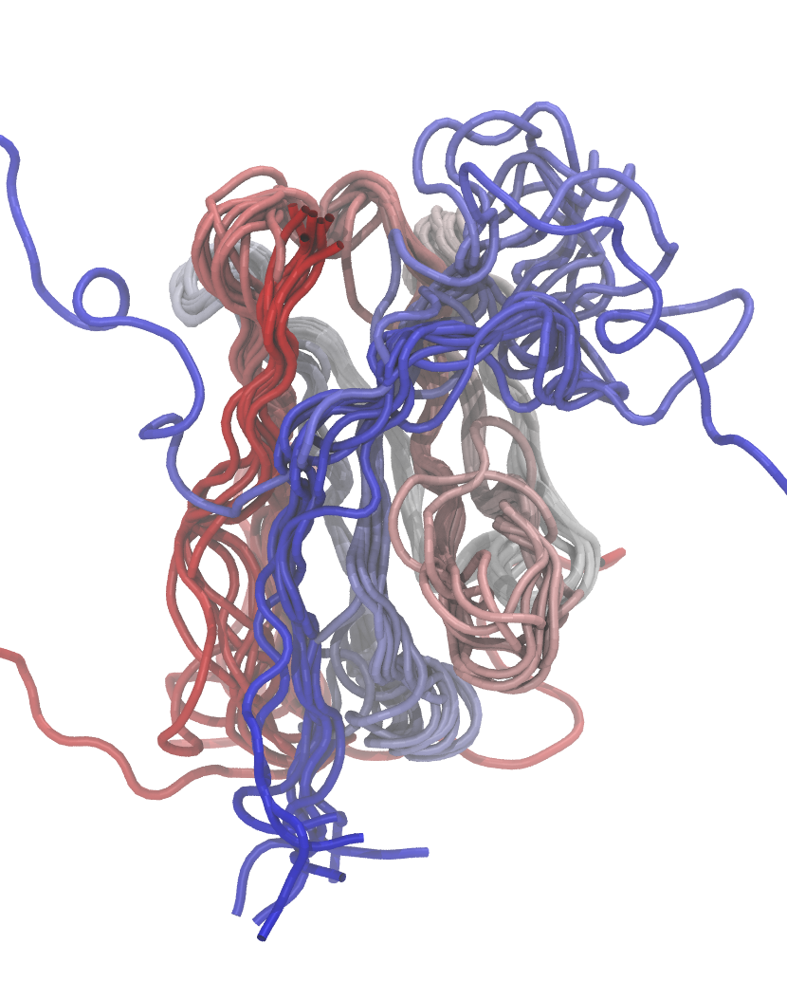

# XXXのシミュレーションに関する研究発表

松永康佑

埼玉大学工学部情報工学科

2023/01/01

---
# 背景

- **XX**は重要である。
- しかし**XX**という問題がある。
- これを解決するためにXXを行う。

---
# 目的

- XXを解決するために、YYを行う。

## 新規性

- ZZが新規性がある。

---
# 方法

## Inline math
Render inline math such as $ax^2+bc+c$.

## Block math
$$ I_{xx}=\int\int_Ry^2f(x,y)\cdot{}dydx $$

$$
f(x) =
  \int_{-\infty}^\infty
  \hat f(\xi)\,e^{2 \pi i \xi x}
  \,d\xi
$$

---
# シミュレーション結果

この結果をみるとYYが見えており、**これは重要**であり。

---
# 解析結果

これはXXXであると解釈できる。

---
# まとめ

- テスト

---
# 付録

---
# 付録の図

